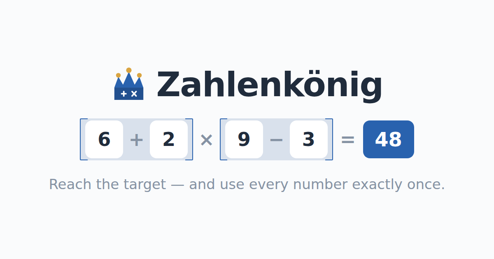

# Zahlenkönig

**A free arithmetic puzzle game for the browser.** You get two to four numbers
and a target, and you have to reach the target using **every number exactly
once** — with plus, minus, times, divide and brackets you place yourself.

**▶ Play: <https://funnygerman.github.io/zahlenkoenig/>**



Built for a wide audience: a first-grader can play it with two numbers and a
plus sign, and an adult can ask for four numbers, all four operators and a
target in the hundreds. No account, no ads, no tracking — it installs as a PWA
and works offline.

## How it works

- **The one rule:** use each of the given numbers exactly once. Reaching the
  target some other way does not count.
- **Tap or drag.** Tap a number, then an operator, and so on. Drag a chip to
  put it somewhere specific, or drag it off the field to take it back.
- **Brackets are yours to place.** Tap the bracket chip to open a group; drag a
  third number onto a bracket edge to pull it inside. `(1 + 1 + 1) × 3 = 9`
  can only be built that way.
- **You choose the difficulty** before you start: how many numbers (2–4), which
  of the four operators are in play, and how big the target should be. You can
  also ask for puzzles that have exactly one solution.
- **Hints place a real move** — never more than half the chips a puzzle needs,
  so the finish is always yours. Take a hinted chip back and you get the hint
  back.
- **Every puzzle is generated on the device** and is guaranteed solvable. There
  is no puzzle bank and nothing is fetched at runtime.
- **Three languages** — German, English and Russian — picked from the browser
  on first visit.

## Tech

React 18 + TypeScript + Vite, deployed to GitHub Pages from `main`. The game
logic lives in `src/core/` as plain TypeScript with no DOM dependency — an
expression tree, an evaluator, an exhaustive solver, the puzzle generator and
the hint engine — and `src/ui/` is the React layer on top of it. No game
framework, no state library, no UI kit.

```sh
npm install
npm run dev        # vite dev server
npm run build      # tsc && vite build — this is the typecheck too
npm test           # vitest run
```

`spec/` holds the design documents (in German) and two self-contained HTML
studies you can open straight in a browser: `entwurf.html`, a clickable draft
of the board, and `generator-audit.html`, a before/after audit of every puzzle
setting the game offers.

## Copyright

© 2026 funnygerman. All rights reserved. Not licensed for reuse.
